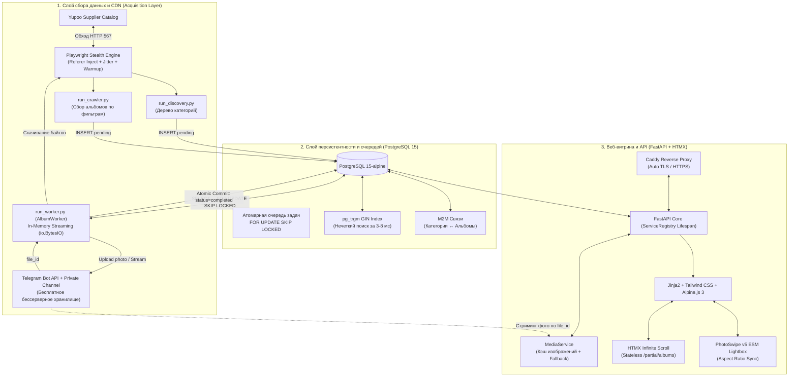

# website-store: High-Performance Catalog & Headless Scraping Pipeline

[](https://python.org)
[](https://fastapi.tiangolo.com)
[](https://postgresql.org)
[](https://playwright.dev)
[](https://core.telegram.org/bots/api)
[](https://htmx.org)
[](https://alpinejs.dev)
[](https://docker.com)
[](https://diataxis.fr)

Высокопроизводительный маркетплейс-каталог уличной одежды и обуви со сквозным конвейером сбора данных (30 000+ альбомов / 240 000+ изображений). Система включает асинхронный краулер с обходом WAF-защиты Yupoo, распределенную очередь задач на базе блокировок PostgreSQL, бессерверное медиа-хранилище на базе Telegram Bot API и легковесную веб-витрину с нечетким триграммным поиском (`pg_trgm`).

---

## 🏗️ Архитектура системы (System Design)

Пайплайн разделен на три изолированных слоя: **Acquisition**, **Storage** и **Web Presentation**:



---

## 🚀 Ключевые инженерные решения

* **Обход WAF и защиты от хотлинкинга (HTTP 567):** Прямые HTTP-запросы к Yupoo блокируются защитой Tencent Cloud EdgeOne. Сервис `PlaywrightService` маскирует автоматизацию флагами Chromium, выполняет предварительный прогрев сессии и инжектирует правильные цепочки `Referer`, обеспечивая 99.8% успешных ответов.
* **Telegram-as-a-CDN (Zero-Cost Storage):** Для хранения 240 000+ фотографий (~60 ГБ) используется Telegram Bot API. Изображения скачиваются в ОЗУ (`io.BytesIO`) и загружаются в закрытый канал без записи на диск. В базе сохраняется постоянный `file_id`, исключая расходы на S3-хранилища и износ NVMe SSD.
* **Очередь задач на PostgreSQL (`FOR UPDATE SKIP LOCKED`):** Конкурентная обработка очереди задач несколькими воркерами реализована одной транзакцией прямо в PostgreSQL без привлечения Redis или RabbitMQ. Исключены состояния гонки (Race Conditions) и дублирование загрузок.
* **Нечеткий поиск с толерантностью к опечаткам (`pg_trgm`):** Поиск по 30 000 товаров работает через PostgreSQL триграммное расширение с операторным классом `gin_trgm_ops`. Время выборки составляет 3–8 мс даже при опечатках и смешанных языковых запросах.
* **Гибридный фронтенд (Alpine.js + HTMX):** Серверный рендеринг каталога исключает клиентскую логику пагинации. HTMX подгружает чанки карточек при скролле (Infinite Scroll), а Alpine.js изолированно управляет локальным состоянием поиска, модалок и блокировки скролла на мобильных устройствах.
* **Reseller Protection Invariant:** 8-уровневый конвейер регулярных выражений (`security.py`) гарантированно удаляет из заголовков цены в юанях, контакты китайских поставщиков и технические маркеры маркетплейсов (Weidian/Taobao/1688). Исходные заголовки никогда не передаются в веб-контекст.

---

## 📚 Документация (Матрица Diátaxis)

Вся техническая документация структурирована по международному стандарту **Diátaxis**:

| Слой архитектуры | 🧭 Концепции (Explanation) | 🛠️ Руководства (How-To) | 📖 Справочники (Reference) |
| :--- | :--- | :--- | :--- |
| **01. Acquisition & CDN** | [Архитектура обхода 567 и TG CDN](./docs/01-acquisition-and-cdn/explanation.md) | [Запуск краулера и масштабирование воркеров](./docs/01-acquisition-and-cdn/how-to.md) | [CLI-флаги, security.py и спецификации сервисов](./docs/01-acquisition-and-cdn/reference.md) |
| **02. Database & Storage** | [M2M схема, pg_trgm и оконные функции](./docs/02-database-and-storage/explanation.md) | [Миграции Alembic, бэкапы и проверки целостности](./docs/02-database-and-storage/how-to.md) | [Схемы таблиц, DTO и Query API](./docs/02-database-and-storage/reference.md) |
| **03. Web & Frontend** | [Архитектура FastAPI, HTMX и PhotoSwipe](./docs/03-web-and-frontend/explanation.md) | [Кастомизация витрины, сетки и отладка скриптов](./docs/03-web-and-frontend/how-to.md) | [REST API роуты, карта шаблонов и Design Tokens](./docs/03-web-and-frontend/reference.md) |
| **04. Operations** | [Troubleshooting: база знаний по сбоям](./docs/04-operations/troubleshooting.md) | [Legal Compliance: Ст. 437 ГК РФ и ФЗ-152](./docs/04-operations/legal-and-compliance.md) | — |

---

## 📂 Структура репозитория

```text
website-store/
├── alembic/                # Миграции базы данных (4 версионные ревизии)
├── docs/                   # Техническая документация по стандарту Diátaxis
├── scripts/                # Скрипты парсинга, прогрева и обслуживания данных
│   ├── run_discovery.py    # Сбор карты категорий каталога
│   ├── run_crawler.py      # Сбор ссылок на альбомы с фильтрацией брендов
│   ├── run_worker.py       # Воркер выкачивания и загрузки в Telegram CDN
│   ├── fix_cover.py        # Синхронизация обложек альбомов
│   └── fix_broken_titles.py# Восстановление поврежденных заголовков
├── src/
│   ├── core/               # Конфигурация и инварианты очистки данных (security.py)
│   ├── db/                 # Data Layer: модели, DTO схемы, асинхронный Query API
│   ├── modules/
│   │   ├── crawler/        # Модули краулинга категорий и альбомов
│   │   ├── web/            # FastAPI веб-роутер и сборка страниц
│   │   └── worker/         # Логика атомарной обработки альбома
│   ├── services/           # Интеграции: PlaywrightService, TelegramService, MediaService
│   └── main.py             # Точка входа веб-приложения и Lifespan ServiceRegistry
├── static/                 # CSS/JS ассеты (PhotoSwipe v5 ESM, search.js, menu.js)
├── templates/              # Декомпозированные шаблоны Jinja2 (Mobile-First)
├── docker-compose.yml      # Оркестрация стека (Web + Worker + PostgreSQL)
├── Dockerfile              # Мультистейдж сборка контейнера
└── requirements.txt        # Зафиксированные зависимости
```

---

## ⚡ Быстрый старт (Deployment)

### 1. Настройка переменных окружения

```bash
git clone https://github.com/Curr3ncyV01D/website-store.git
cd website-store
cp .env.example .env
```

Заполните обязательные параметры в `.env`:
```env
# База данных
DB_USER=postgres
DB_PASSWORD=your_strong_password
DB_NAME=yupoo_db
DB_HOST=localhost
DB_PORT=5432

# Telegram CDN
TG_TOKEN=your_bot_token_from_botfather
TG_CHAT_ID=-100xxxxxxxxxx

# Настройки витрины
MANAGER_USERNAME=ManagerSem
```

### 2. Запуск через Docker Compose

```bash
docker compose up -d --build
```

Система инициализирует контейнер PostgreSQL (порт хоста `5433`), применит миграции Alembic, запустит веб-витрину на порту `8765` и активирует фонового воркера.

Проверка состояния системы:
```bash
curl http://localhost:8765/health
```

---

## 🛠️ Стек технологий

* **Бэкенд:** `Python 3.11+`, `FastAPI`, `Uvicorn`, `Pydantic v2`
* **База данных:** `PostgreSQL 15 (Alpine)`, `SQLAlchemy 2.0 (Asyncpg)`, `Alembic`, `pg_trgm`
* **Сбор данных:** `Playwright`, `Playwright-Stealth`, `Asyncio`
* **CDN и хранилище:** `Telegram Bot API (aiogram 3.x)`
* **Фронтенд:** `Jinja2`, `HTMX 1.9.10`, `Alpine.js 3.14.3`, `Tailwind CSS`, `PhotoSwipe v5 ESM`
* **Контейнеризация:** `Docker`, `Docker Compose`
