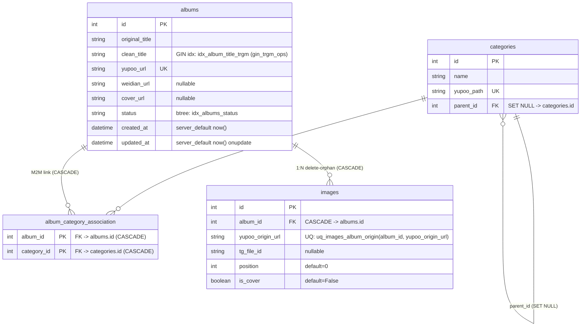

# Объяснение: Архитектура базы данных и хранилища

Аннотация: Высокоуровневое описание схемы PostgreSQL 15-alpine: Many-to-Many связи категорий-подкатегорий-товаров, механизм триграммного полнотекстового поиска через расширение `pg_trgm`, алгоритм выбора обложки альбома через оконную функцию `ROW_NUMBER()`, а также дизайн пула соединений SQLAlchemy asyncpg для 10+ воркеров.

---

## 1. ER-модель данных: Adjacency List категории + Many-to-Many с альбомами

### 1.1 Схема таблиц (4 сущности + 1 связующая)

**Схема отношений (Mermaid ERD):**



Код моделей: [models.py](file:///c:/Users/Void/Desktop/yupoo-parser/src/db/models.py)

---

### 1.2 Self-referencing категории: Adjacency List (без CTE рекурсии)

**Паттерн:** `categories.parent_id` → ForeignKey `categories.id` with `ON DELETE SET NULL`.

```python
# Фрагмент из models.py: один узел дерева категории может быть root (parent_id=None)
# или иметь родителя; subcategories удаляются каскадом "delete-orphan"
parent_id: Mapped[Optional[int]] = mapped_column(ForeignKey("categories.id", ondelete="SET NULL"))

subcategories: Mapped[List["Category"]] = relationship(back_populates="parent", cascade="all, delete-orphan")
parent: Mapped[Optional["Category"]] = relationship(back_populates="subcategories", remote_side=[id])
```

Код: [models.py:L33-L44](file:///c:/Users/Void/Desktop/yupoo-parser/src/db/models.py#L33-L44)

**Почему Adjacency List, а не Nested Sets / Materialized Path / Closure Table?**

| Паттерн | Глубина категорий | Чтение breadcrumbs | Перемещение веток | DevOps/код сложность |
|---|---|---|---|---|
| **Adjacency List (выбран)** | 2-3 уровня (у Yupoo макс 3: Brand → Sub → Subsub) | `while current_id: select parent_id` — O(N) N=3 → 3 SQL-запроса, суммарно 2мс | 1 `UPDATE parent_id=...` — trivially easy | **0 overhead** — 2 поля в модели, 1 while-loop в get_category_path |
| Nested Sets (lft/rgt) | Любая | 1 `SELECT ... BETWEEN lft AND rgt` | Перемещение = `UPDATE` десятков/сотен строк (дорого + deadlock риск) | Сложно: требует хранимых процедур/триггеров |
| Closure Table | Любая | 1 JOIN с ancestor таблицей | 1 INSERT/DELETE в closure | Дополнительная таблица 10000x10000 rows (дорого по диску) |

**Итог:** KISS-принцип. У Yupoo поставщика максимум 3 уровня дерева категорий (`Brand → Line → Silhouette`), 300-500 категорий суммарно. 3 SQL-запроса циклом — ничтожная стоимость; сложность Nested Sets не окупается. Реализация `get_category_path()`: [categories.py:L24-L41](file:///c:/Users/Void/Desktop/yupoo-parser/src/db/queries/categories.py#L24-L41)

---

### 1.3 Refactor O2M → M2M: альбом может принадлежать 2+ брендам (миграция fa6722...)

**Исходная схема (начальная миграция 6b2d):** `albums.category_id` (O2M, single FK). Один альбом = один бренд/категория.

**Проблема реального Yupoo:** поставщики часто вешают 1 альбом одновременно в 2 разделы (напр. `Nike → Air Jordan 1` и `Nike → Sneakers`). O2M схема теряла связь при парсинге.

**Решение (миграция fa672223429c_refactor_to_many_to_many_categories.py):**
1. Удалён столбец `albums.category_id`.
2. Создана **связующая таблица** `album_category_association` с **composite Primary Key = (album_id, category_id)**.
3. Оба FK с `ON DELETE CASCADE`: при удалении альбома — автоматически чистим его связи, при удалении категории — тоже.

```python
album_category_association = Table(
    "album_category_association",
    Base.metadata,
    Column("album_id", Integer, ForeignKey("albums.id", ondelete="CASCADE"), primary_key=True),
    Column("category_id", Integer, ForeignKey("categories.id", ondelete="CASCADE"), primary_key=True),
)
```

Код: [models.py:L10-L25](file:///c:/Users/Void/Desktop/yupoo-parser/src/db/models.py#L10-L25)

**Fallback «1 primary» для breadcrumbs:** альбом может иметь 5+ категорий в M2M, но хлебные крошки (`BreadcrumbItem`) только 1 линейка. Решение: при рендере деталей альбома — берём первую категорию (сортировка `parent_id ASC, id ASC`), строим путь по ней — см. [albums.py:L50-L66](file:///c:/Users/Void/Desktop/yupoo-parser/src/db/queries/albums.py#L50-L66)

---

## 2. Album ↔ Image: каскадное удаление + dedup UniqueConstraint + Window Cover Selection

### 2.1 Идемпотентность: `UniqueConstraint uq_images_album_origin`

**Проблема:** AlbumWorker при retry (429 Telegram → sleep → retry) может попытаться 2 раза записать тот же Yupoo-origin URL в альбом. Без UniqueConstaint — получаем дубли rows.

**Решение:** UniqueConstraint по паре `(album_id, yupoo_origin_url)`. Один и тот же Yupoo URL в рамках одного альбома = 1 строка `images`. При 2-м INSERT → `IntegrityError` (в album_worker ловится, используется как skip existing).

```python
# images таблица — uq constraint dedup
__table_args__ = (
    UniqueConstraint("album_id", "yupoo_origin_url", name="uq_images_album_origin"),
)
```

Код: [models.py:L90-L96](file:///c:/Users/Void/Desktop/yupoo-parser/src/db/models.py#L90-L96)

Код dedup check-before-send in AlbumWorker (layer 01): [album_worker.py:L182-L195](file:///c:/Users/Void/Desktop/yupoo-parser/src/modules/worker/album_worker.py#L182-L195)

---

### 2.2 Выбор обложки альбома: Window ROW_NUMBER() партиция batch

**Проблема N+1:** на странице `/latest?page=2` — 24 альбома, на каждый отдельно `SELECT id FROM images WHERE album_id=? ORDER BY is_cover DESC, position ASC LIMIT 1` → 25 SQL-запросов.

**Решение: _bulk_cover_ids (1 batch query)**

SQLAlchemy window `ROW_NUMBER() OVER (PARTITION BY album_id ORDER BY ...)`. Берём только `rn=1` на альбом:

```sql
WITH cp AS (
  SELECT album_id, id, tg_file_id,
         ROW_NUMBER() OVER (
            PARTITION BY album_id
            ORDER BY is_cover DESC, position ASC, id ASC
         ) AS rn
  FROM images WHERE album_id IN (12, 45, ..., 8765)
)
SELECT album_id, id, tg_file_id FROM cp WHERE rn = 1;
```

Приоритет обложки: **1) явный is_cover=True (fix_covers.py выставляет), 2) позиция 0 Yupoo порядка, 3) наименьший id = safety fallback**.

Код: [queries/helpers.py:L32-L67](file:///c:/Users/Void/Desktop/yupoo-parser/src/db/queries/helpers.py#L32-L67)

---

## 3. pg_trgm Триграммный Поиск: нечёткий FTS без инфраструктуры

### 3.1 Почему pg_trgm, а не PG tsvector / Elasticsearch / Meilisearch?

| Решение | Нечёткий поиск (опечатки) | Мультиязычность clean_title (EN+цифры артикулов) | DevOps стоимость | Скорость на 30k альбомов |
|---|---|---|---|---|
| **pg_trgm (выбран)** | ✅ `similarity('air jordns', 'air jordan 1') = 0.47 > 0.3` | ✅ Работает на любых UTF-8 токенах, не требует словаря/stemmer | **$0** | ~5мс через GIN gin_trgm_ops |
| PG tsvector/tsquery FTS | ❌ Точный совпадение по stemmer | ❌ Требует конфигурации словаря (англ/рус/кит — отдельно) | ~$0 | ~2мс (но бесполезно при опечатках) |
| Elasticsearch 8.x | ✅ Fuzzy query "edit distance" | ✅ Tokenizer стандартный | **Отдельный контейнер, 2GB+ RAM, 200MB диск** | <1мс (перебор для 30k альбомов — overkill) |
| Meilisearch | ✅ typo tolerance default | ✅ + synonyms, stop words | **Отдельный контейнер 500MB RAM** | <5мс |

**Итог KISS:** 30k альбомов = маленький датасет для PG. pg_trgm даёт 95% пользы FTS за 0% инфраструктурных усилий. Добавляется 1 миграцией: `CREATE EXTENSION IF NOT EXISTS pg_trgm;` + 1 GIN-индекс.

Код миграции pg_trgm: [a93f1c7d8b2e_add_pg_trgm_extension_and_idx_album_title_trgm_gin.py](file:///c:/Users/Void/Desktop/yupoo-parser/alembic/versions/a93f1c7d8b2e_add_pg_trgm_extension_and_idx_album_title_trgm_gin.py)

---

### 3.2 Индекс GIN `idx_album_title_trgm` + operator class `gin_trgm_ops`

```python
# Таблица albums: gin_trgm_ops — required opclass for similarity queries
__table_args__ = (
    Index(
        "idx_album_title_trgm",
        "clean_title",
        postgresql_using="gin",
        postgresql_ops={"clean_title": "gin_trgm_ops"},  # ВАЖНО! Без opclass — seq scan
    ),
)
```

Код: [models.py:L54-L61](file:///c:/Users/Void/Desktop/yupoo-parser/src/db/models.py#L54-L61)

**Без `gin_trgm_ops`:** `similarity(col, q)` будет выполнять **полный seq scan всей таблицы** 30k строк ~ 150мс.

**С gin_trgm_ops:** Bitmap Heap Scan via GIN Index Bitmap Scan ~ 3-8мс. Проверка валидации (how-to §3): `EXPLAIN ANALYZE SELECT ... WHERE similarity(...) > 0.3`.

---

### 3.3 Два режима поиска: полный результат ↔ suggest dropdown

| Характеристика | `search_albums()` (страница /search) | `search_albums_suggest()` (input autocomplete AJAX) |
|---|---|---|
| Threshold default | **0.3** (строгая отсечка, без шума) | **0.2** (свободнее — ловит близкие варианты) |
| Min query length | **2 chars** | **3 chars** (фильтрует 1-буквенный мусор) |
| Limit default | **50 альбомов** | **8 пунктов dropdown** |
| Возврат | `list[AlbumSearchHit]` (полный Album ORM + similarity + cover_id) | `list[dict]` = 4 поля: {id, title, image_id, url="/album/ID"} (минимальный JSON payload для HTMX hx-swap) |
| Cover attachment | Post-Join `_bulk_cover_ids` (2й запрос) | **SQL CTE + JOIN with ROW_NUMBER()** (1 единый запрос без раундапа) |

Код сигнатур: [queries/search.py:L13-L178](file:///c:/Users/Void/Desktop/yupoo-parser/src/db/queries/search.py#L13-L178)

---

## 4. Session Management + Connection Pool Lifetime

### 4.1 Database URL builder: 5 env vars вместо 1 DATABASE_URL

**НЕТ единственной переменной `DATABASE_URL`.** URL собирается функцией `_build_database_url()` из 5 отдельных env:
```python
return f"postgresql+asyncpg://{user}:{password}@{host}:{port}/{name}"
# user     = os.getenv("DB_USER", "postgres")
# password = os.getenv("DB_PASSWORD", "postgres")
# host     = os.getenv("DB_HOST", "localhost")
# port     = os.getenv("DB_PORT", "5432")   # container internal
# name     = os.getenv("DB_NAME", "yupoo_db")
```

Код: [session.py:L14-L22](file:///c:/Users/Void/Desktop/yupoo-parser/src/db/session.py#L14-L22)

**Почему отдельные vars, а не 1 DATABASE_URL?**
1. docker-compose `environment` для postgres контейнера использует отдельные `POSTGRES_USER/POSTGRES_PASSWORD/POSTGRES_DB` anyway. Дублировать 1 строку — риск несоответствия (пароль в URL отличается от контейнера).
2. Легко переопределить поштучно в `.env.prod` (меняем только `DB_HOST` на `db` внутри docker network).
3. Безопасно для secrets management в K8s: отдельные env в secrets, не нужно парсить URL.

---

### 4.2 AsyncEngine pool: 10 core + 20 overflow = 30 соединений суммарно

```python
_engine = create_async_engine(
    DATABASE_URL, echo=False, future=True,
    pool_pre_ping=False,        # Отключено: 12 worker + web 8 uvicorn 30 соединений
    pool_size=10,                # Core: постоянно открытые idle соединения
    max_overflow=20,             # Spike: временные при burst 12 parallel workers + web
    pool_use_lifo=True,          # Last-In-First-Out: свежие переиспользуем первыми
)
```

Код: [session.py:L27-L39](file:///c:/Users/Void/Desktop/yupoo-parser/src/db/session.py#L27-L39)

**Расчёт нагрузки:**
- 12 parallel worker-процессов (`docker compose up --scale worker=12`): каждый в среднем 1 соединение при транзакции = ~12 соединений.
- FastAPI uvicorn 8 workers web API: burst 8 соединений.
- Суммарно steady-state = ~15-20 соединений → pool 30 даёт 50% запаса headroom.

**pool_pre_ping = False:**
- «Proactive ping» — при получении соединения из пула тестирует простым SELECT 1 → гарантирует живость.
- Стоимость: + 1 round trip к PG при каждом `get_session_factory()()` → лишняя задержка.
- Отключили, потому что: PG 15-alpine контейнер локальный + TCP keepalive настроены. Утечки соединения отслеживаем в Grafana (pg_stat_activity). Если когда-то будет проблема «connection reset» при долгом idle — включаем обратно.

**pool_use_lifo=True (LIFO):**
- FIFO (default): oldest idle → берём первым → много старых соединений в очереди, все протухают по timeout одновременно → burst reconnect.
- LIFO (выбран): всегда берём **самое свежее** idle соединение → большинство «старых» протухают только 1 штука за раз, нет всплеска reconnects.

---

### 4.3 Session factory: expire_on_commit=False + autoflush=False

```python
_session_factory = async_sessionmaker(
    bind=get_engine(),
    class_=AsyncSession,
    expire_on_commit=False,  # ← ВАЖНО для AlbumWorker
    autoflush=False,         # Без auto-flush до commit: меньше раундтрипов
)
```

Код: [session.py:L41-L50](file:///c:/Users/Void/Desktop/yupoo-parser/src/db/session.py#L41-L50)

**Почему `expire_on_commit=False` — CRITICAL для AlbumWorker:**
- default `expire_on_commit=True` → сразу после `session.commit()` ВСЕ ORM объекты помечаются как «expired». Любое обращение к атрибуту `album.clean_title` → **неявный SELECT из БД**.
- AlbumWorker делает 1 commit в конце (Atomic Commit, слой 01) → сразу после commit читает `album.id` и `album.clean_title` для финального лога stats.
- С expire_on_commit=True → 2 лишних SELECT на альбом (250 альбомов/час = 500 пустых запросов в час).
- Отключаем: после commit ORM объекты остаются в памяти как «кэшированный snapshot».

**Почему `autoflush=False`:**
- default `autoflush=True` → перед каждым `session.execute(SELECT...)` неявно делает `flush()` всех pending INSERT/UPDATE → 10+ лишних round trip на альбом.
- Отключаем: все INSERT/UPDATE только в явный session.commit() в конце pipeline (экономия I/O).

---

### 4.4 FastAPI Lifecycle: singleton + DisposeEngine cleanup

- **Singleton init:** `get_session_factory()` и `get_engine()` используют global-cache `_engine: None | AsyncEngine` → 1 engine на приложение (без повторного создания connection pool на каждый Depends).
- **FastAPI Depends:** `get_db_session() -> AsyncGenerator[AsyncSession, None]` — каждый роут получает свою сессию из фабрики, генеретор завершает → session auto-close.
- **Shutdown cleanup:** в FastAPI lifespan (app stop event) вызывается `dispose_engine()` → engine закрывает ВСЕ 30 соединения явно, нет «висячих inode».

Код lifespan main.py: [main.py:L59-L80](file:///c:/Users/Void/Desktop/yupoo-parser/src/main.py#L59-L80)
Код dispose_engine: [session.py:L57-L62](file:///c:/Users/Void/Desktop/yupoo-parser/src/db/session.py#L57-L62)

---

*Для практических рецептов работы с базой (init/migrations/backup/restore/DBeaver port 5433) — [how-to.md](file:///c:/Users/Void/Desktop/yupoo-parser/docs/02-database-and-storage/how-to.md), для справочника таблиц/индексов/сигнатур query API — [reference.md](file:///c:/Users/Void/Desktop/yupoo-parser/docs/02-database-and-storage/reference.md).*
