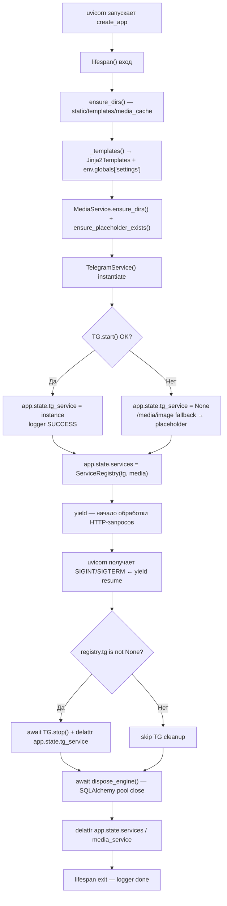
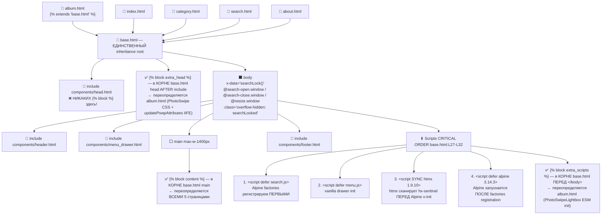
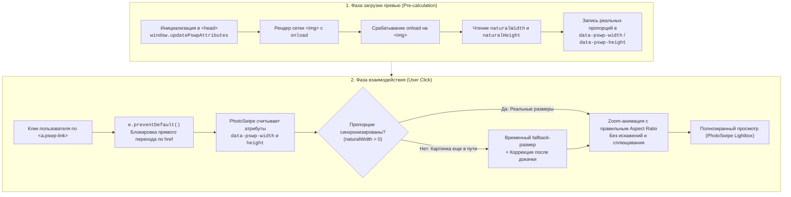

# Объяснение: Архитектура веб-платформы и витрины

Аннотация: Высокоуровневое описание клиентской и серверной архитектуры веб-слоя: Mobile-First подход к верстке каталога, механизм Infinite Scroll и пагинации через HTMX без перезагрузки страниц, а также схема TLS Termination и доменной маршрутизации через обратный прокси Caddy.

---

## 2.1 FastAPI Lifespan + Service Registry (Anti-singleton дублирования)

Ключевое архитектурное решение серверной части — отказ от устаревшего паттерна `@router.on_event('startup')` / `'shutdown'` в пользу единого `lifespan` async context manager и иммутабельного реестра сервисов `ServiceRegistry`.

### Проблема устаревшего подхода
При использовании `@router.on_event('startup')` на каждом included роутере и `@app.on_event('startup')` на корневом приложении SQLAlchemy engine и Telegram-сессия создавались дважды: один раз в lifespan, второй — в startup-хуках. Это приводило к:
- Утечкам `AiohttpSession` в `TelegramService` (накопление ~100 не закрытых соединений после суток работы).
- Двойной инициализации `QueuePool` (pool_size=10 × 2 = 20 фактических соединений против 10 по конфигу).
- Невозможности передать shutdown-сигнал в экземпляр TG-сервиса, созданный внутри `@router.on_event`.

### Решение: ServiceRegistry frozen dataclass
Единственный реестр long-lived сервисов объявляется как `@dataclass(frozen=True)` в [main.py:L31-L42](file:///C:/Users/Void/Desktop/yupoo-parser/src/main.py#L31-L42):

```python
@dataclass(frozen=True)
class ServiceRegistry:
    tg: Optional[TelegramService]
    media: MediaService
```

Immutable-структура гарантирует, что роутеры/мидлвари не могут подменить экземпляр в runtime: только читают `app.state.services`. Любой доступ к БД/TG/медиа идёт через Depends-функции, возвращающие `registry.tg`, `registry.media`, а не собственные global singleton.

### Жизненный цикл приложения (lifespan startup → yield → shutdown)



Полная последовательность cleanup-шагов зафиксирована в [main.py:L105-L133](file:///C:/Users/Void/Desktop/yupoo-parser/src/main.py#L105-L133). Depends-функции, пробрасывающие сервисы в роутеры-хендлеры с fallback-цепочкой (от registry → app.state → None), живут в [router.py:L58-L76](file:///C:/Users/Void/Desktop/yupoo-parser/src/modules/web/router.py#L58-L76).

---

## 2.2 Jinja2 Decomposition Protocol (Phase4 block scope bugfix кодифицирован)

Второе критическое архитектурное решение — жёсткий протокол декомпозиции шаблонов. Источником протокола стал баг Phase4: когда PhotoSwipe CSS объявили внутри `` в `components/head.html` (внутри include-файла), а не в корне `base.html` — переопределение блока в `album.html` полностью игнорировалось Jinja2 (блоки внутри `` не входят в scope наследования).

### Схема наследования шаблонов с правильным scope блоков



### Два жёстких правила CRITICAL Protocol

1. **Правило Scope блоков.** Все четыре блока Jinja для переопределения (`title`, `extra_head`, `content`, `extra_scripts`) объявляются **только в корне `base.html`**, никогда — внутри ``-файлов. Если блок поместить в included компонент (например, в `components/head.html`), Jinja выкинет его из цепочки наследования и дочерний `` в `album.html` никогда не сработает. Инвентарь всех блоков с расположением см. справочник [reference.md §4.2](file:///C:/Users/Void/Desktop/yupoo-parser/docs/03-web-and-frontend/reference.md).

2. **Правило порядка скриптов.** Четыре тега `<script>` в [base.html:L27-L32](file:///C:/Users/Void/Desktop/yupoo-parser/templates/base.html#L27-L32) стоят в EXACT ORDER (поменяете 2 соседних — сломается один из Phase4 багов):
   - `search.js defer` → меню `menu.js defer` → `htmx 1.9.10 SYNC` → `alpine 3.14.3 defer` → ``.
   - Причина: Alpine factory `searchLock()` должен быть зарегистрирован в IIFE `search.js` **до** того, как `alpinejs defer` отсканирует `x-data="searchLock()"` на `<body>`. HTMX стоит SYNC между ними, чтобы он обработал `hx-sentinel` (revealed trigger) **до** того, как Alpine начнёт инициализацию `x-effect` и потенциально модифицирует DOM.

---

## 2.3 Alpine 3.14 + HTMX 1.9.10 Hybrid (разделение ответственности)

Третье архитектурное решение — **гибридная схема stateful Alpine.js + stateless HTMX**, где каждый инструмент решает только свой класс задач. «Либо Alpine, либо HTMX» antipattern отвергнут на этапе Phase3:

| Парадигма | За кого отвечает | Где живёт в коде |
|-----------|------------------|------------------|
| **Alpine 3.14 stateful** | Вся client-side интерактивность, требующая локального состояния: открытие/закрытие search dropdown, modal/bottomsheet order, scroll lock, дебаунс поисковых suggest, window CustomEvent шина. | `static/js/search.js` (2 factories) + inline `x-data` в [album.html:L69-L105](file:///C:/Users/Void/Desktop/yupoo-parser/templates/album.html#L69-L105) |
| **HTMX 1.9.10 stateless** | Всё, что можно описать как «подгрузи HTML-фрагмент с сервера и замени DOM-узел»: **Infinite Scroll** каталога (нет client-side fetch pagination → 0 багов с race offset). | `hx-*` атрибуты в [album_grid_chunk.html](file:///C:/Users/Void/Desktop/yupoo-parser/templates/components/album_grid_chunk.html) + роут [router.py:L173-L223](file:///C:/Users/Void/Desktop/yupoo-parser/src/modules/web/router.py#L173-L223) `/partial/albums` |

### Window CustomEvents Protocol (Pub/Sub между независимыми Alpine компонентами)

Три глобальных события на `<body>` в [base.html:L8-L14](file:///C:/Users/Void/Desktop/yupoo-parser/templates/base.html#L8-L14) обеспечивают loose coupling между компонентами без прямой ссылки на DOM друг друга:

```
headerSearch.open() → emit document.dispatchEvent(new CustomEvent('search-open'))
                                                   ↓
                    @search-open.window на <body> searchLock → _searchOpen=true → overflow-hidden + savedScrollY

headerSearch.closeAll() → emit 'search-close'
                                                   ↓
                    @search-close.window на <body> → _searchOpen=false → scrollTo(savedScrollY)

window resize (orientation change mobile)
                                                   ↓
                    @resize.window → _updateLock() recompute _isMobile() < 768px
```

### Re-entrancy guard для scroll lock (два Alpine компонента модифицируют body.overflow)

Частая ловушка гибридных Alpine-схем: два независимых `x-data` одновременно ставят/снимают `document.body.classList.add('overflow-hidden')` — второй при закрытии снимет блокировку, которую выставил первый, и пользователь получает резкий скролл наверх.

Решение: локальный boolean guard `_weLocked` в inline factory order modal [album.html:L69-L105](file:///C:/Users/Void/Desktop/yupoo-parser/templates/album.html#L69-L105):

```
_on open orderModal:
    if NOT body.classList.contains('overflow-hidden') → мы первые → ставим → _weLocked = true
    else → searchLock уже держит lock → _weLocked = false (НЕ ТРОГАЙ при закрытии!)

_on close orderModal:
    if _weLocked === true → только тогда remove overflow-hidden + restore savedScrollY
    else → пропускаем cleanup → overflow-hidden от searchLock продолжает жить
```

---

## 2.4 PhotoSwipe v5: Self-hosted ESM + Critical updatePswpAttributes Protocol (Phase4 Bugfix)

Четвёртое решение — self-hosted интеграция PhotoSwipe v5 ESM вместо unpkg CDN с жёстким протоколом инициализации размеров изображений.

### Почему self-hosted, а не unpkg CDN?
Два приоритета:
1. **Обход санкционных блокировок CDN.** Файлы PhotoSwipe v5 валидны локально: [photoswipe-lightbox.esm.js](file:///C:/Users/Void/Desktop/yupoo-parser/static/js/photoswipe-lightbox.esm.js), [photoswipe.esm.js](file:///C:/Users/Void/Desktop/yupoo-parser/static/js/photoswipe.esm.js), [photoswipe.css](file:///C:/Users/Void/Desktop/yupoo-parser/static/css/photoswipe.css).
2. **Детерминированная загрузка.** Встроенные ESM import гарантируют, что лайтбокс инициализируется сразу после DOMContentLoaded независимо от доступности внешних CDN.

### Флоу интеграции: от клика до зум-овера



### Critical Protocol: updatePswpAttributes в extra_head ДО `<body>`

Это правило извлечено из Phase4 дебага PhotoSwipe багов (aspect искажение + ReferenceError). Суть:
- Если картинка лежит в HTTP-кеше браузера, `onload` стреляет **в тот же такт**, когда парсер доходит до тега `` в body. Если функция `updatePswpAttributes` объявлена в конце страницы (`extra_scripts`) или в отдельном `.js defer` — к моменту срабатывания `onload` она **ещё не существует**, получаем `ReferenceError: updatePswpAttributes is not defined`.
- Решение: IIFE, объявляющая `window.updatePswpAttributes` и подписывающаяся на `DOMContentLoaded` + `htmx:afterSwap`, живёт **строго внутри ``** в [album.html:L29-L65](file:///C:/Users/Void/Desktop/yupoo-parser/templates/album.html#L29-L65) — то есть определяется ДО парсинга `<body>`.
- Idempotency guard на каждый ``: `onload="(typeof window.updatePswpAttributes === 'function') && window.updatePswpAttributes(this)"` (см [album.html:L149](file:///C:/Users/Void/Desktop/yupoo-parser/templates/album.html#L149)) — двойной вызов безвреден, вызов до объявления не падает.

### 3 init опции PhotoSwipeLightbox (VERBATIM album.html:L317-L319)

Все три параметра перечислены в справочнике [reference.md §4.4](file:///C:/Users/Void/Desktop/yupoo-parser/docs/03-web-and-frontend/reference.md). Отладка в DevTools через глобальный дебаг-хэндл `window.__ps_lightbox = lightbox;` [album.html:L323](file:///C:/Users/Void/Desktop/yupoo-parser/templates/album.html#L323).

---

> **Reseller Protection Invariant (сквозной для всего Web-слоя).** В Jinja context, JSON-ответы и DTO **никогда** не попадают поля `original_title` (неочищенный с Yupoo заголовок) и `weidian_url` (прямая ссылка на продавца в Weidian): роутер пробрасывает только `clean_title`. Единственное упоминание этих полей в веб-слое — охранный комментарий [router.py:L302-L303](file:///C:/Users/Void/Desktop/yupoo-parser/src/modules/web/router.py#L302-L303). Проверка инварианта — рецепт R7 в [how-to.md](file:///C:/Users/Void/Desktop/yupoo-parser/docs/03-web-and-frontend/how-to.md).
