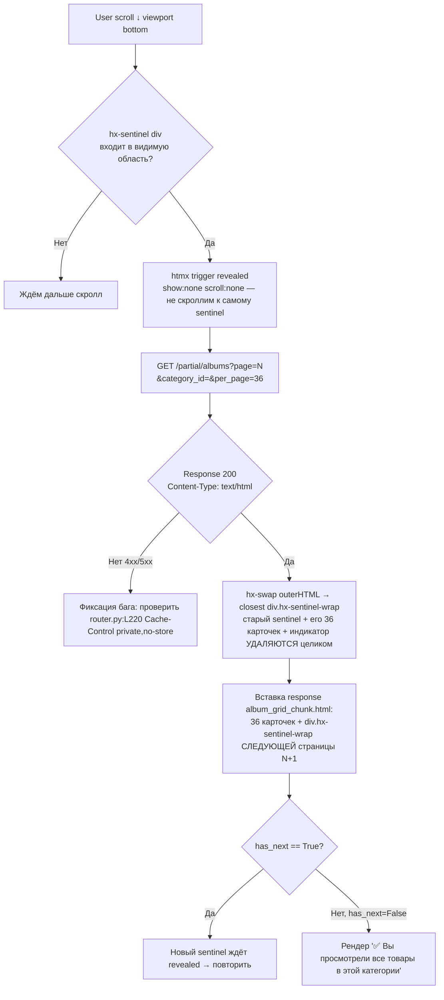

# Практическое руководство: Домен, SSL, бренды-карусель и PhotoSwipe галерея

Аннотация: Пошаговые инструкции: привязка стороннего домена и выпуск бесплатного SSL-сертификата Let's Encrypt через Caddy, настройка и добавление новых брендов в hero-карусель главной страницы, а также конфигурация, отладка и кастомизация галереи изображений на PhotoSwipe v5.

---

## R1. Локальный запуск FastAPI web dev-сервера (без Docker)

Запуск только через `venv` python (системный python не имеет dotenv → `ModuleNotFoundError: No module named 'dotenv'`).

### Шаги (PowerShell / CMD Windows)
```powershell
cd c:\Users\Void\Desktop\yupoo-parser
.\.venv\Scripts\python.exe -m uvicorn src.main:app --reload --port 8765
```

### Проверки
1. Откройте http://localhost:8765/ → главная с hero-каруселью брендов.
2. Откройте http://localhost:8765/health → JSON-ответ с полями:
   ```json
   {
     "status": "ok",
     "services": {
       "telegram_available": true,
       "media_available": true
     }
   }
   ```
3. `telegram_available: false` — проверьте `.env` наличие `TG_TOKEN` и `TG_CHAT_ID` (fallback работает: `/media/image/{id}` отдаст `no-image.png` плейсхолдер).

Исходники: [`create_app` main.py:L148-L178](file:///C:/Users/Void/Desktop/yupoo-parser/src/main.py#L148-L178), [`health` main.py:L163-L176](file:///C:/Users/Void/Desktop/yupoo-parser/src/main.py#L163-L176).

---

## R2. Добавить новый роут + шаблон (пример: `/brands` топ N брендов по альбомам)

Шаблон протокола: каждый роут → Depends-ы session/tpl → HTMLResponse с `TemplateResponse` → Reseller Protection invariant.

### Шаги
1. **Открыть роутер** [src/modules/web/router.py](file:///C:/Users/Void/Desktop/yupoo-parser/src/modules/web/router.py), вставить ПЕРЕД последней пустой строкой перед `src/__init__.py`:
   ```python
   @router.get("/brands", response_class=HTMLResponse, tags=["pages"])
   async def brands_page(
       request: Request,
       db: AsyncSession = Depends(get_db_session),
       tpl: Jinja2Templates = Depends(_get_templates),
   ):
       rows = await get_brands_by_album_count(db, limit=50)
       return tpl.TemplateResponse(
           "brands.html",
           {"request": request, "brands": rows, "query": ""},  # ← Reseller: только clean поля!
       )
   ```
2. **Создать шаблон** `templates/brands.html` — ОБЯЗАТЕЛЬНО наследуемся от `base.html` (единственный inheritance root):
   ```jinja2
   
   Бренды — Каталог
   
   <section class="pb-6">
     <h1 class="text-2xl font-black pb-3">Все бренды</h1>
     <div class="grid grid-cols-2 sm:grid-cols-3 md:grid-cols-4 lg:grid-cols-5 xl:grid-cols-6 gap-3 md:gap-5">
       
         <a href="{{ b.url }}" class="album-card shadow-card bg-surface p-3 rounded-2xl">{{ b.name }} · {{ b.count }}</a>
       
     </div>
   </section>
   
   ```
3. **Проверить Reseller Protection** (нигде не передаём `original_title` / `weidian_url` — см рецепт R7 grep audit).
4. **Перезапустить uvicorn** (или auto-reload сработает сам) → открыть http://localhost:8765/brands.

Исходник: [11 существующих роутов router.py:L102-L449](file:///C:/Users/Void/Desktop/yupoo-parser/src/modules/web/router.py#L102-L449) для копирования сигнатур Depends.

---

## R3. Отладка Alpine ExpressionError (если searchLock/headerSearch не определены)

Воспроизведение: открываете DevTools Console → видите красную ошибку:
```
Alpine Expression Error: searchLock is not defined
Expression: "searchLock()"
```

### Методика 3 гипотез (как в Phase4 scientific debug):

| # | Гипотеза | Диагностика (что сделать) | Fix |
|---|----------|---------------------------|-----|
| H1 | `search.js` не загрузился | DevTools → Network → фильтр JS → найти `/static/js/search.js` → Status 200? Size non-zero? | 404 → проверьте [`_mount_static()` main.py:L136-L145](file:///C:/Users/Void/Desktop/yupoo-parser/src/main.py#L136-L145), файл существует. Если ERR_BLOCKED_BY_CLIENT → adblock, отключите для локалхоста. |
| H2 | **Нарушен Script Order CRITICAL Protocol** (самая частая причина Phase4 bug) | Проверьте порядок тегов `<script>` в [base.html:L27-L32](file:///C:/Users/Void/Desktop/yupoo-parser/templates/base.html#L27-L32). Должно быть строго: (1) search.js defer → (2) menu.js defer → (3) htmx SYNC → (4) alpine 3.14.3 defer → (5) extra_scripts block. | Если alpine стоит ПЕРЕД search.js → поменяйте. Причина: factories `searchLock`/`headerSearch` должны быть зарегистрированы через IIFE search.js **до** `alpine:init` события. |
| H3 | IIFE idempotency guard в search.js отвалился (редко) | Откройте [search.js:L126-L132](file:///C:/Users/Void/Desktop/yupoo-parser/static/js/search.js#L126-L132). Блок должен быть ЕДИНСТВЕННЫМ: если `window.Alpine.data` существует сейчас → регистрируем factories `_register(Alpine)` сразу; иначе вешаем `addEventListener('alpine:init', …)`. | Если отсутствует → вставьте VERBATIM этот 7-строчный guard. |

### Quick fix check
В консоли DevTools введите:
```js
typeof window.Alpine !== 'undefined' && typeof window.Alpine.store === 'function'
typeof document.body.__x !== 'undefined'   // Alpine инициализирован?
```

---

## R4. Кастомизировать grid-cols каталога (количество колонок карточек)

Grid-классы повторяются на 4 страницах + 1 shared partial skeleton. Чтобы все страницы визуально консистентны — меняйте **во всех 5 местах одновременно**:

### Таблица замен (grid каталога альбомов: mobile 2 → sm 3 → md 4 → lg 5 → xl 6 default)

| # | Файл / Диапазон строк | Что меняем |
|---|------------------------|------------|
| 1 | [index.html:L22](file:///C:/Users/Void/Desktop/yupoo-parser/templates/index.html#L22) | `grid grid-cols-2 sm:grid-cols-3 md:grid-cols-4 lg:grid-cols-5 xl:grid-cols-6 gap-3 md:gap-5` |
| 2 | [category.html:L35](file:///C:/Users/Void/Desktop/yupoo-parser/templates/category.html#L35) | То же самое точное значение |
| 3 | [search.html:L25](file:///C:/Users/Void/Desktop/yupoo-parser/templates/search.html#L25) | То же самое точное значение |
| 4 | [components/album_grid_chunk.html:L50](file:///C:/Users/Void/Desktop/yupoo-parser/templates/components/album_grid_chunk.html#L50) skeleton grid | То же самое (иначе skeleton будет другой плотности) |
| 5 | [components/album_grid_chunk.html:L5](file:///C:/Users/Void/Desktop/yupoo-parser/templates/components/album_grid_chunk.html#L5) outer grid | То же самое |

### Grid галереи альбома (3/4/6/8 columns) — отдельно!
Замените только в [album.html:L120](file:///C:/Users/Void/Desktop/yupoo-parser/templates/album.html#L120):
```
grid grid-cols-3 sm:grid-cols-4 md:grid-cols-6 lg:grid-cols-8 gap-1.5 md:gap-2 md:gap-3
```

Схема responsive breakpoints по умолчанию зашита в Tailwind default screens: sm=640 / md=768 / lg=1024 / xl=1280.

---

## R5. Отладка PhotoSwipe зум с кривым aspect ratio

Воспроизведение: кликаете по картинке в альбоме → оверлей PS открывается, но изображение растянуто/сжато, aspect ratio не совпадает с превью.

### 3 диагностики по порядку (Critical Protocol Phase4 lesson)

1. **Проверка атрибутов data-pswpWidth/data-pswpHeight.**
   DevTools → Elements → найти `<a class="pswp-link">` обёртку кликнутого img → проверить `data-pswp-width` / `data-pswp-height` (camelCase → kebab-case в атрибутах). **Ожидание**: значения равны `naturalWidth × naturalHeight` (например, 1440×1920). **Факт дефекта**: `1000` / `1000` (hardcoded placeholder атрибуты) — значит `updatePswpAttributes` не отработал.

2. **Проверка существования функции.** В DevTools Console выполните:
   ```js
   typeof window.updatePswpAttributes === 'function'   // ОЖИДАНИЕ: true
   ```
   Если `false` или `undefined` → нарушено **Critical Protocol объявления**: функция должна жить **строго в `` album.html**, то есть внутри `<head>` **ДО парсинга `<body>`**. Если её перенесли в `` (в конец body) или в отдельный `defer`-файл — для cached image `onload` стреляет раньше объявления → ReferenceError → атрибуты не проставлены.

3. **Проверка typeof guard на каждом ``.** В DevTools Elements → найти `` внутри `a.pswp-link` → проверить атрибут `onload="…"`. Ожидание:
   ```
   onload="(typeof window.updatePswpAttributes === 'function') && window.updatePswpAttributes(this)"
   ```
   (см [album.html:L149](file:///C:/Users/Void/Desktop/yupoo-parser/templates/album.html#L149)). Если guard отсутствует → при раннем `onload` (before function defined) получаем ReferenceError даже при правильном расположении extra_head.

Исходник Critical Protocol IIFE: [album.html:L29-L65](file:///C:/Users/Void/Desktop/yupoo-parser/templates/album.html#L29-L65).

---

## R6. HTMX Infinite Scroll отладка (перестали подгружаться страницы 2+)

### Flow пайплайна (4 фазы с Mermaid)



### 4 диагностики по порядку
1. Network XHR → фильтр `/partial/albums` → HTTP Status 200? Если 404 → опечатка URL. Если 422 ValidationError → `page:int[ge=1]` или `category_id:Optional[int]` не проходят Depends.
2. Response Content-Type `text/html; charset=utf-8`? Если JSON → в роутере поставили `JSONResponse` вместо `HTMLResponse`.
3. В теле ответа в самом конце есть `<div class="hx-sentinel-wrap …"` с `hx-get="/partial/albums?page=3"`? Если нет, а только message `"end"` → передан `has_next=False` слишком рано.
4. Skeleton-индикатор отображается в момент загрузки (`.htmx-request .htmx-indicator { opacity: 1 }`). См. CSS стилю в [head.html:L20-L26](file:///C:/Users/Void/Desktop/yupoo-parser/templates/components/head.html#L20-L26).

Параметры sentinel атрибутов VERBATIM в [album_grid_chunk.html:L55-L62](file:///C:/Users/Void/Desktop/yupoo-parser/templates/components/album_grid_chunk.html#L55-L62). `per_page=36` константа в [router.py header](file:///C:/Users/Void/Desktop/yupoo-parser/src/modules/web/router.py).

---

## R7. Reseller Protection аудит — проверить отсутствие утечек original_title/weidian_url

Сквозной инвариант веб-слоя: в Jinja context, JSON API ответы, DTO, шаблоны — **никогда** не попадают поля `original_title` и `weidian_url`. Единственное разрешённое упоминание — охранный комментарий в роутере (см ниже).

### Команды PowerShell Grep Audit (cd в project root)

```powershell
# A. Проверка templates/ и templates/components/ — ОЖИДАНИЕ: 0 совпадений
cd c:\Users\Void\Desktop\yupoo-parser
Select-String -Path "templates\*.html","templates\components\*.html" -Pattern "original_title|weidian_url" -List

# B. Проверка web router.py — ОЖИДАНИЕ: ТОЛЬКО 1 совпадение, текст — Reseller Protection comment
Select-String -Path "src\modules\web\router.py" -Pattern "original_title|weidian_url" | Select-Object LineNumber,Line
```

### Ожидаемые результаты
```
A. → ПУСТОЙ ВЫВОД (нет ни одного файла с совпадением)
B. → LineNumber 302-303:
       302: # Reseller Protection:
       303: # NEVER pass original_title or weidian_url into template context.
```

### Фиксация дефекта
Если grep нашёл `{{ detail.original_title }}` в шаблоне → заменить на `{{ detail.clean_title }}`. Если нашли ссылку `weidian_url` → удалить поле из передаваемого в TemplateResponse dict. Комментарий [router.py:L302-L303](file:///C:/Users/Void/Desktop/yupoo-parser/src/modules/web/router.py#L302-L303) должен остаться как единственное упоминание.

---

## R8. Self-hosting библиотек — обход санкционных блокировок CDN

По умолчанию Tailwind, HTMX, Alpine, Google Fonts Inter/JetBrains Mono тянутся с CDN. Если пользователь из России/RB → blank page / no interactivity. Рецепт self-host.

### Шаги (качаем 6 файлов, 2 шрифта, меняем 1 файл includes)

1. **Создаём структуру** (папки существуют — проект уже имеет static/, дополнительно fonts/):
   ```
   static/
   ├─ js/
   │   ├─ alpine.min.js      ← NEW
   │   ├─ htmx.min.js        ← NEW
   │   ├─ tailwindcss.js     ← NEW (Standalone CLI build)
   │   ├─ search.js          OK существовал
   │   ├─ menu.js            OK существовал
   │   ├─ photoswipe*.esm.js OK
   ├─ css/
   │   └─ photoswipe.css     OK
   ├─ fonts/                 ← NEW mkdir
   │   ├─ Inter-VariableFont_slnt,wght.woff2
   │   └─ JetBrainsMono-VariableFont_wght.woff2
   ```

2. **Скачиваем 6 артефактов (curl или wget PowerShell):**
   ```powershell
   cd c:\Users\Void\Desktop\yupoo-parser\static
   # 1. Alpine 3.14.3
   Invoke-WebRequest -Uri "https://unpkg.com/alpinejs@3.14.3/dist/cdn.min.js" -OutFile "js\alpine.min.js"
   # 2. HTMX 1.9.10
   Invoke-WebRequest -Uri "https://unpkg.com/htmx.org@1.9.10" -OutFile "js\htmx.min.js"
   # 3. Tailwind Standalone CLI
   Invoke-WebRequest -Uri "https://github.com/tailwindlabs/tailwindcss/releases/download/v3.4.17/tailwindcss-windows-x64.exe" -OutFile "js\tailwindcss.exe"
   ```

3. **Шрифты Google Fonts** (Inter + JetBrains Mono): зайти на https://fonts.google.com → Download family → распаковать .woff2 в `static/fonts/`.

4. **Заменяем в components/head.html + base.html все CDN-ссылки на /static/ локальные пути.**
   - `<script src="https://unpkg.com/htmx.org@1.9.10">` → `<script src="/static/js/htmx.min.js">`
   - `<script defer src="https://unpkg.com/alpinejs@3.14.3/...">` → `<script defer src="/static/js/alpine.min.js">`
   - `<link href="https://fonts.googleapis.com/...">` → локальный `@font-face` в inline style head.html.
   - `<script src="https://cdn.tailwindcss.com">` → локальный tailwindcss.exe + prebuild CSS или runtime Standalone mode `<script src="/static/js/tailwindcss.exe"></script>` (для dev; для prod запустите tailwindcss cli один раз).

---

### А. Структура templates/ компонентов — ASCII tree (разрешённый случай ASCII art = file trees)
```
templates/
├── base.html                      ← ЕДИНСТВЕННЫЙ extends root. 4 Jinja block: title/extra_head/content/extra_scripts
├── index.html                     ← extends base. Hero carousel брендов + latest_albums grid
├── category.html                  ← extends base. Breadcrumbs + pluralization + grid albums
├── album.html                     ← extends base. extra_head=PhotoSwipe CSS+updatePswp, content=gallery+order, extra_scripts=PS init
├── search.html                    ← extends base. Query/results count/0-results typo hint
├── about.html                     ← extends base. 3 contact cards manager/IG/TG reviews
└── components/
    ├── head.html                  ← include base <head>: Tailwind config inline + x-cloak CSS + markLoaded+htmx:afterSwap
    ├── header.html                ← include base body: sticky header + searchLock/headerSearch x-data dual desktop/mobile
    ├── menu_drawer.html           ← include base body: 13 vanilla getElementById IDs для menu.js
    ├── footer.html                ← include base body: copyright #y year + link menu
    ├── album_grid_chunk.html      ← SHARED PARTIAL (extends NO base!). Shared fragment index/category/search HTMX sentinel
    └── skeleton_card.html         ← include album_grid_chunk: 6 skeleton placeholder карт пока грузится page N
```
